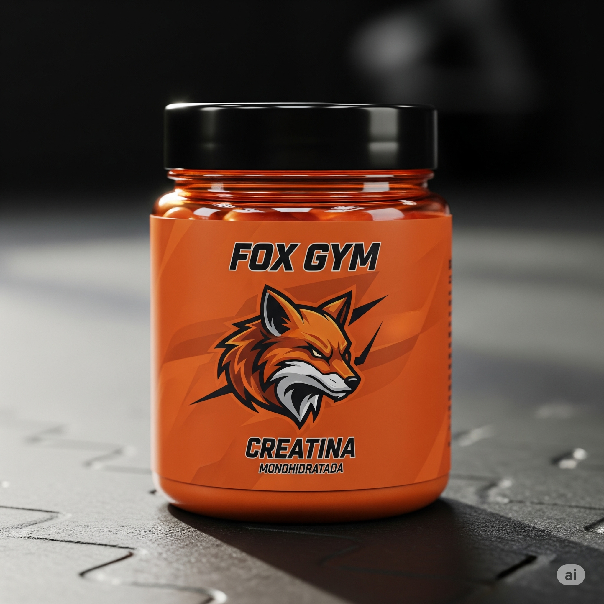
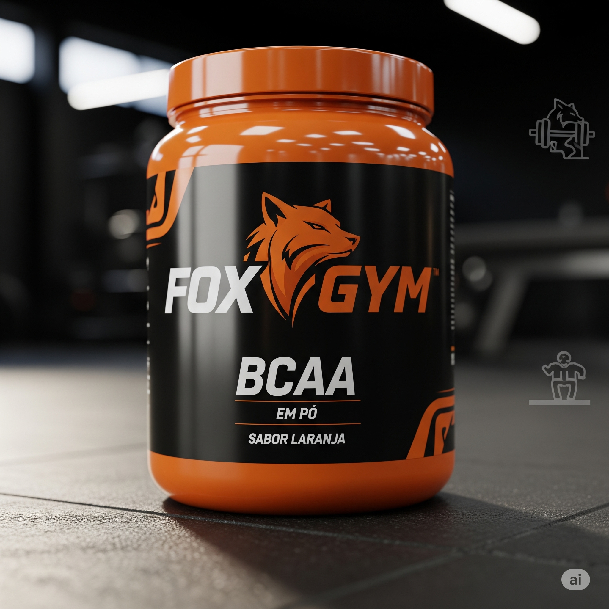
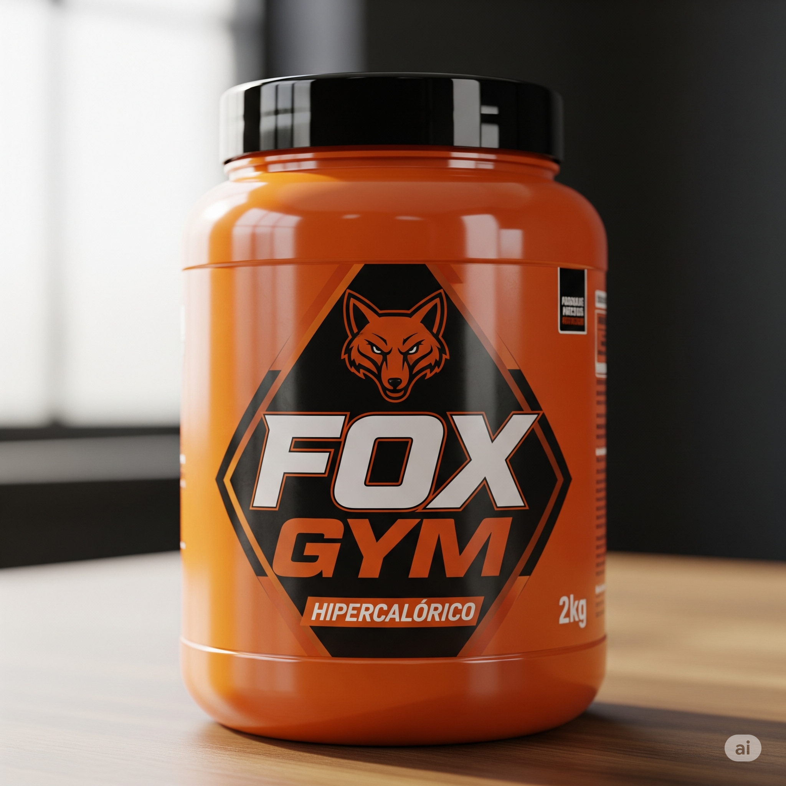
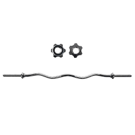
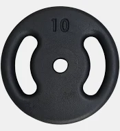
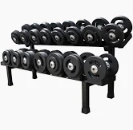
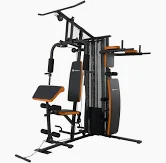

<!DOCTYPE html>
<html lang="pt-br">
<head>
  <meta charset="UTF-8" />
  <meta name="viewport" content="width=device-width, initial-scale=1.0" />
  <title>Fox Gym - Loja de Suplementos</title>
  
  <link rel="stylesheet" href="https://cdn.jsdelivr.net/npm/swiper@10/swiper-bundle.min.css" />
  
</head>

<body class="bg-gray-100 text-gray-800">

  <!-- WhatsApp -->
  <a href="https://wa.me/5533984430371" target="_blank" class="whatsapp-btn" aria-label="WhatsApp">💬</a>

  <!-- Header -->
  <header class="bg-orange-600 text-white p-6 md:p-10 mb-10 rounded-b-xl">
    

      <h1 class="text-4xl md:text-6xl font-bold mb-2">Fox Gym</h1>
      
Suplementos com design exclusivo

    

  </header>

  <a href="Untitled-1.html" class="text-blue-500 dark:text-blue-400 hover:underline">
    Voltar para login
  </a>

 

  <a href="Untitled-4.html" class="text-blue-500 dark:text-blue-400 hover:underline">
    Voltar para a página principal
  </a>

  <!-- Carrossel Swiper.js -->
  <section class="container mx-auto mb-10">
    <h2 class="text-3xl font-bold text-center text-orange-600 mb-6">Destaques</h2>
    

      

        

        

        

        

        

      

      

    

  </section>

  <!-- Loja / Carrinho -->
  <section class="container mx-auto px-4 mb-16">
    <h2 class="text-3xl font-bold text-orange-600 mb-6">Loja Fox Gym</h2>
    

      
     <body>
      <h2 class="topico-suplementos">Suplementos</h2>

     </body>

      <!-- Whey -->

      

        
        <h3 class="text-xl font-semibold">Whey Protein</h3>
        
R$ 129,90

        <button onclick="addToCart('Whey Protein',129.90)" class="mt-2 bg-orange-600 text-white px-4 py-2 rounded hover:bg-orange-700">Adicionar</button>
      

      <!-- Creatina -->
      

        
        <h3 class="text-xl font-semibold">Creatina</h3>
        
R$ 89,90

        <button onclick="addToCart('Creatina',89.90)" class="mt-2 bg-orange-600 text-white px-4 py-2 rounded hover:bg-orange-700">Adicionar</button>
      

      <!-- Pré-Treino -->
      

        
        <h3 class="text-xl font-semibold">Pré-Treino</h3>
        
R$ 99,90

        <button onclick="addToCart('Pré-Treino',99.90)" class="mt-2 bg-orange-600 text-white px-4 py-2 rounded hover:bg-orange-700">Adicionar</button>
      

      <!-- BCAA -->
      

        
        <h3 class="text-xl font-semibold">BCAA</h3>
        
R$ 79,90

        <button onclick="addToCart('BCAA',79.90)" class="mt-2 bg-orange-600 text-white px-4 py-2 rounded hover:bg-orange-700">Adicionar</button>
      

      <!-- Glutamina -->
      

        
        <h3 class="text-xl font-semibold">Glutamina</h3>
        
R$ 69,90

        <button onclick="addToCart('Glutamina',69.90)" class="mt-2 bg-orange-600 text-white px-4 py-2 rounded hover:bg-orange-700">Adicionar</button>
      

    

    <title>Mais informações no link abaixo</title>
</head>
<body>
    <h1>Mais informações no link abaixo 👇</h1>
    
    <!-- Link simples -->
    <a href="t3.html" target="_blank">
        saiba mais
    </a>
</body>
<!-- Calculadora de Frete com Cidade pelo CEP -->

  <h3 style="text-align:center; color:#1d4ed8;">Calculadora de Frete</h3>
  <input type="number" id="frete-valor" placeholder="Valor do pedido (R$)" style="width:100%; padding:10px; margin:10px 0; border-radius:5px; border:1px solid #ccc;">
  <input type="text" id="frete-cep" placeholder="CEP de destino (somente números)" style="width:100%; padding:10px; margin:10px 0; border-radius:5px; border:1px solid #ccc;">
  <button id="frete-calcular" style="width:100%; padding:10px; background:#1d4ed8; color:white; border:none; border-radius:5px; cursor:pointer;">Calcular Frete</button>
  

    

      <h3 class="text-xl font-bold mb-2">🛒 Carrinho:</h3>
      <ul id="cartItems" class="list-disc list-inside text-gray-700"></ul>
      
Total: R$ 0,00

      <button onclick="openPix()" class="mt-4 bg-green-600 text-white px-6 py-2 rounded hover:bg-green-700">Pagar com PIX</button>
    

  </section>
     <section>
        

          
  <!-- Produtos já existentes... (Whey, Creatina, etc.) -->
     <body>
      <h2 class="topico-acessorios">Acessórios</h2>

     </body>
  <!-- Luvas de Treino -->
  

    
    <h3 class="text-xl font-semibold">Luvas de Treino</h3>
    
R$ 49,90

    <button onclick="addToCart('Luvas de Treino',49.90)" class="mt-2 bg-orange-600 text-white px-4 py-2 rounded hover:bg-orange-700">Adicionar</button>
  

  <!-- Cinto de Levantamento -->
  

    
    <h3 class="text-xl font-semibold">Cinto de Levantamento</h3>
    
R$ 119,90

    <button onclick="addToCart('Cinto de Levantamento',119.90)" class="mt-2 bg-orange-600 text-white px-4 py-2 rounded hover:bg-orange-700">Adicionar</button>
  

  <!-- Garrafa Térmica -->
  

    
    <h3 class="text-xl font-semibold">Garrafa Térmica 1L</h3>
    
R$ 59,90

    <button onclick="addToCart('Garrafa Térmica 1L',59.90)" class="mt-2 bg-orange-600 text-white px-4 py-2 rounded hover:bg-orange-700">Adicionar</button>
  

  <!-- Faixa de Resistência -->
  

    
    <h3 class="text-xl font-semibold">Faixa de Resistência</h3>
    
R$ 34,90

    <button onclick="addToCart('Faixa de Resistência',34.90)" class="mt-2 bg-orange-600 text-white px-4 py-2 rounded hover:bg-orange-700">Adicionar</button>
  

  <!-- Mochila Esportiva -->
  

    
    <h3 class="text-xl font-semibold">Mochila Esportiva</h3>
    
R$ 139,90

    <button onclick="addToCart('Mochila Esportiva',139.90)" class="mt-2 bg-orange-600 text-white px-4 py-2 rounded hover:bg-orange-700">Adicionar</button>
  

  <!-- Toalha de Treino -->
  

    
    <h3 class="text-xl font-semibold">Toalha de Treino</h3>
    
R$ 29,90

    <button onclick="addToCart('Toalha de Treino',29.90)" class="mt-2 bg-orange-600 text-white px-4 py-2 rounded hover:bg-orange-700">Adicionar</button>
  

 <section>

     <body>
      <h2 class="topico-equipamentos">equipamentos</h2>

     </body>
    <!-- Halteres Ajustáveis -->

  
  <h3 class="text-xl font-semibold">Halteres Ajustáveis (até 24kg)</h3>
  
R$ 699,90

  <button onclick="addToCart('Halteres Ajustáveis (até 24kg)',699.90)" class="mt-2 bg-orange-600 text-white px-4 py-2 rounded hover:bg-orange-700">Adicionar</button>

<!-- Barra W -->

  
  <h3 class="text-xl font-semibold">Barra W (Rosca Direta)</h3>
  
R$ 229,90

  <button onclick="addToCart('Barra W (Rosca Direta)',229.90)" class="mt-2 bg-orange-600 text-white px-4 py-2 rounded hover:bg-orange-700">Adicionar</button>

<!-- Anilha Olímpica 10kg -->

  
  <h3 class="text-xl font-semibold">Anilha Olímpica 10kg</h3>
  
R$ 129,90

  <button onclick="addToCart('Anilha Olímpica 10kg',129.90)" class="mt-2 bg-orange-600 text-white px-4 py-2 rounded hover:bg-orange-700">Adicionar</button>

<!-- Suporte para Halteres -->

  
  <h3 class="text-xl font-semibold">Suporte para Halteres</h3>
  
R$ 499,90

  <button onclick="addToCart('Suporte para Halteres',499.90)" class="mt-2 bg-orange-600 text-white px-4 py-2 rounded hover:bg-orange-700">Adicionar</button>

<!-- Banco Regulável -->

  
  <h3 class="text-xl font-semibold">Banco Regulável para Musculação</h3>
  
R$ 599,90

  <button onclick="addToCart('Banco Regulável para Musculação',599.90)" class="mt-2 bg-orange-600 text-white px-4 py-2 rounded hover:bg-orange-700">Adicionar</button>

<!-- Cadeira Extensora -->

  
  <h3 class="text-xl font-semibold">Cadeira Extensora</h3>
  
R$ 2.499,90

  <button onclick="addToCart('Cadeira Extensora',2499.90)" class="mt-2 bg-orange-600 text-white px-4 py-2 rounded hover:bg-orange-700">Adicionar</button>

<section>
   

<!-- Corda Naval -->

  
  <h3 class="text-xl font-semibold">Corda Naval 12m</h3>
  
R$ 399,90

  <button onclick="addToCart('Corda Naval 12m',399.90)" class="mt-2 bg-orange-600 text-white px-4 py-2 rounded hover:bg-orange-700">Adicionar</button>

<!-- Tapete de Yoga -->

  
  <h3 class="text-xl font-semibold">Tapete de Yoga Antiderrapante</h3>
  
R$ 89,90

  <button onclick="addToCart('Tapete de Yoga Antiderrapante',89.90)" class="mt-2 bg-orange-600 text-white px-4 py-2 rounded hover:bg-orange-700">Adicionar</button>

</section>
 </section>
     </section>
  <!-- Modal PIX -->
  

    

      <h2 id="pixTitle" class="text-2xl font-bold mb-4">Pague com PIX</h2>
      <!-- Aqui vai o seu QR Code real -->
      
      <button onclick="closePix()" class="bg-gray-500 text-white px-4 py-2 rounded">Fechar</button>
      

        Este é um exemplo. Em um site real, esta imagem seria um QR Code gerado dinamicamente para o pagamento.
      

    

  

  <!-- Formulário Contato -->
  <section class="container mx-auto bg-white p-6 rounded-xl shadow-md mb-16">
    <h2 class="text-3xl font-bold text-orange-600 mb-4">Fale Conosco</h2>
    <form action="https://formspree.io/f/mayzklaw" method="POST" class="space-y-4">
      

        <label class="block text-sm font-medium" for="name">Nome</label>
        <input type="text" id="name" name="name" required class="w-full border rounded px-4 py-2" />
      

      

        <label class="block text-sm font-medium" for="email">Email</label>
        <input type="email" id="email" name="email" required class="w-full border rounded px-4 py-2" />
      

      

        <label class="block text-sm font-medium" for="message">Mensagem</label>
        <textarea id="message" name="message" rows="4" required class="w-full border rounded px-4 py-2"></textarea>
      

      <button type="submit" class="bg-orange-600 text-white px-6 py-2 rounded hover:bg-orange-700">Enviar</button>
    </form>
  </section>
 
  <!-- Rodapé -->
  <footer class="bg-orange-600 text-white text-center p-6 mt-10 rounded-t-xl">
    
&copy; 2025 Fox Gym. Todos os direitos reservados.

    
Instagram: <a href="https://www.instagram.com/arlen_165" target="_blank" class="underline">foxgymoficial</a>

  </footer>

  <!-- Scripts -->
  
  
  

</body>

</html>

